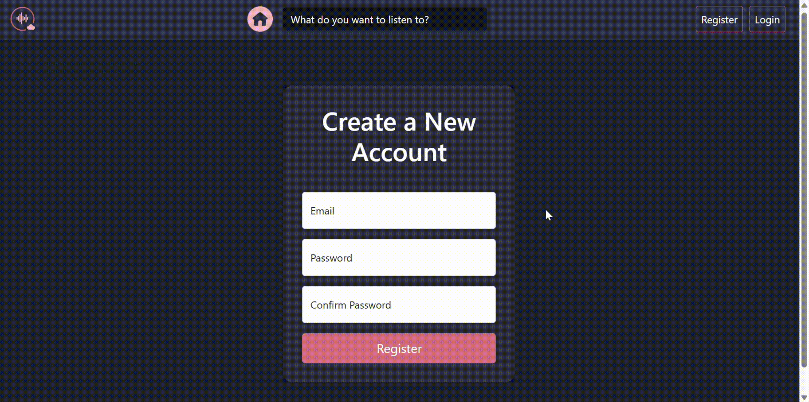

# 🎵 **CloudSync Music Streaming App**

**CloudSync** is a simplified music streaming web application built using **ASP.NET Core MVC**. It enables users to browse songs, view artist information, and play audio files directly from the browser, offering a seamless music experience.

## 🔍 **Project Overview**
CloudSync integrates **ASP.NET Core MVC**, **Entity Framework Core** for database management, and **HTML/CSS** for creating a modern and responsive user interface.

### ✨ **Key Features**
- 🔐 **User Authentication and Authorization**: Secure registration and login functionality.
- 🎶 **Dynamic Song Management**: Displays songs dynamically based on database entries.
- 🎤 **Artist and Genre Information**: Provides details about artists and their associated songs.
- 🔊 **Audio Playback**: Integrated audio player for playing songs directly from the web app.
- 🗂️ **Structured MVC Architecture**: Uses Models, Views, and Controllers to separate concerns.

## 🛠 **Technology Stack**
- **Frontend**: _HTML5_, _CSS3_, _Bootstrap_
- **Backend**: _C#_, _ASP.NET Core MVC_
- **Database**: _MS SQL Server with Entity Framework Core_
- **Tools**: _Azure Data Studio_, _Visual Studio_, _Git_

## 🚀 **Installation**

### 📋 **Prerequisites**
Before you begin, ensure you have the following tools installed:

- .NET Core SDK 6.0 or higher
- MS SQL Server or Azure Data Studio
- An IDE like Visual Studio or Visual Studio Code

### 🛠 **Installation Steps**

1. **Clone the Repository**:

    ```bash
    git clone https://github.com/naomieniola/CloudSyncApp.git
    cd CloudSyncApp
    ```

2. **Set Up the Database**:

   - Download the `setup-database.sql` file in the repository.
   - Open **Azure Data Studio** and connect to your local SQL Server instance.
   - Open the `setup-database.sql` file and execute the script to create tables and insert sample data.

3. **Configure the Application**:

   - Open the `appsettings.json` file.
   - Update the `DefaultConnection` string to match your local database configuration:

     ```json
     "ConnectionStrings": {
       "DefaultConnection": "Server=localhost;Database=CloudSyncdb;Trusted_Connection=True;"
     }
     ```

4. **Run the Application**:

   Use Visual Studio or the terminal to start the application:

   ```bash
   dotnet run

**Demo**:

   

